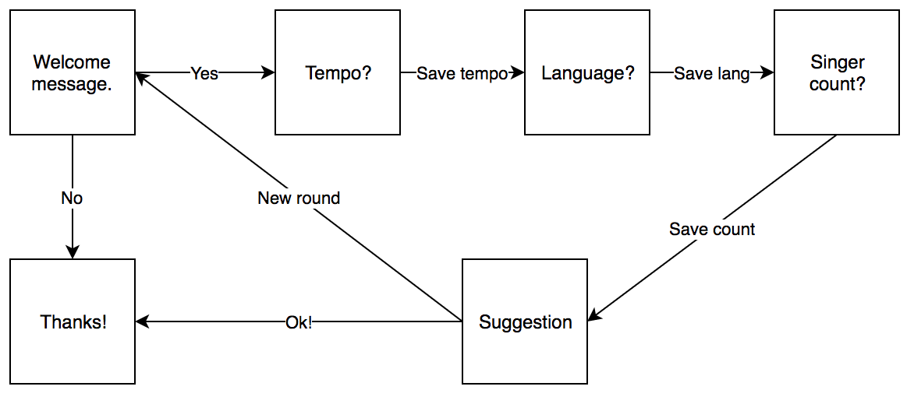

# Eurovision bot

There are existing multiple cloud services that helps in the chatbot creation process. For creating simple bots you don't even have to code a single line, you can define the content and dialog flows in a graphical web UI.

One of these services is [Chatfuel](https://chatfuel.com/). Using the Chatfuel-service for demo purposes is free, you just need a Facebook account. This demo shows how you can build a simple facebook bot that recommends Eurovision songs to user based on her interests.

Unfortunately due to recent data breaches [in Facebook](https://messenger.fb.com/newsroom/messenger-platform-changes-in-development/) we cannot actually connect the bots to Facebook pages, but we can still use the Chatfuel service for testing them.

## Login to Chatfuel

[Login](https://dashboard.chatfuel.com/) to Chatfuel with your Facebook account. Create new bot.

## Design the flow

First you should have some idea what kind of dialog flow you are creating.

Eurovision bot has simple structure. It requests three attributes from user and based on this input it suggests a suitable Eurovision entry the user might like.

## Create blocks

Blocks are containers for one or multiple cards. When a block gets triggered, a bot user will receive all the cards which are contained in the block. Cards are the most basic building component of a bot. They can contain anything from a simple text message or image, to other plugins which allow more advanced actions.

## Test

Remember to test your bot often! Click the button "Test this chatbot" and the bot will be triggered in your Facebook Messenger.

## See example workflow on video

